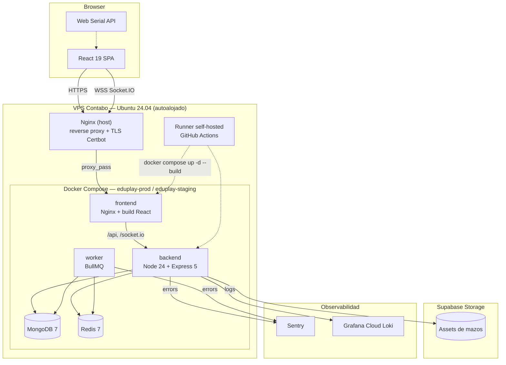

# EduPlay RFID

[](https://github.com/Samuel-Prog-CSec/TFG-IoT/actions/workflows/build.yml)
[](https://sonarcloud.io/summary/new_code?id=Samuel-Prog-CSec_TFG-IoT)
[](backend/package.json)
[](LICENSE)

> Plataforma educativa con tarjetas RFID. Los docentes crean sesiones de juego; los alumnos juegan con tarjetas físicas leídas por el navegador (Web Serial API) o por toque táctil.

---

## Descripción

EduPlay es una plataforma de juegos educativos pensada para niños de 4-6 años de Educación Infantil. El docente prepara mazos de cartas (asociación de imágenes, secuencias, parejas de memoria) y los asocia a tarjetas RFID físicas. En clase, los alumnos juegan colocando las tarjetas sobre un sensor USB conectado a un portátil con el navegador.

**Mecánicas soportadas:**

- **Asociación** — el alumno encuentra la carta que pide la consigna.
- **Memoria** — el alumno empareja cartas iguales recordando posiciones.
- **Secuencia** — el alumno reproduce en orden la secuencia que el sistema muestra.

Para centros sin lector RFID, todas las mecánicas funcionan también con un panel táctil como fallback.

---

## Arquitectura de despliegue



`eduplay-staging` y `eduplay-prod` corren en la misma VPS como proyectos Docker Compose independientes (Mongo/Redis propios, sin compartir volúmenes ni red), aislados por nombre de proyecto y puerto interno (`127.0.0.1:8080` staging / `127.0.0.1:8090` prod). Nginx en el host hace de reverse proxy con TLS (Let's Encrypt vía Certbot) hacia cada stack según el dominio. El despliegue lo dispara un runner self-hosted de GitHub Actions instalado en la propia VPS — ver [`documentation/Deploy_VPS.md`](documentation/Deploy_VPS.md).

---

## Stack

| Capa | Tecnología | Versión |
|---|---|---|
| **Backend** | Node.js / Express | 24 / 5.x |
| **ORM** | Mongoose | 9.x |
| **Realtime** | Socket.IO | 4.x |
| **Validación** | Zod | 4.x |
| **Logging** | Pino structured | 10.x |
| **Queues** | BullMQ + Redis 7 | 5.x / 7 |
| **Frontend** | React + Vite | 19 / 8.x |
| **Routing** | React Router | 7.x |
| **Styling** | Tailwind CSS | 4.x |
| **Animations** | Framer Motion | 12.x |
| **Charts** | Recharts | 3.x |
| **Database** | MongoDB | 7 (contenedor Docker en la VPS) |
| **Cache + queues** | Redis | 7 (contenedor Docker en la VPS) |
| **Hosting** | VPS Contabo (autoalojado) | Ubuntu 24.04 |
| **Reverse proxy / TLS** | Nginx + Certbot (Let's Encrypt) | — |
| **Storage** | Supabase | Free |
| **Observability** | Sentry + Pino + Grafana Cloud Loki | — |
| **IoT** | ESP8266 + RC522 RFID | PlatformIO (C++) |
| **CI/CD** | GitHub Actions (runner self-hosted) + release-please + SonarCloud | — |

---

## Requisitos

Para **desarrollo local**:

- Node.js ≥ 24.14.0 (recomendado 24 LTS).
- Docker + Docker Compose (para MongoDB y Redis locales).
- Git con soporte de hooks (Husky + commitlint).
- Navegador moderno con Web Serial API: Chrome/Edge ≥ 89. Firefox/Safari no soportan Web Serial — los alumnos usan el modo táctil fallback.

Para el **despliegue autoalojado** (opcional, en TFG):

- Acceso a una VPS con Docker Engine + Compose plugin, Nginx y Certbot. Ver [`documentation/Deploy_VPS.md`](documentation/Deploy_VPS.md) para el aprovisionamiento paso a paso.

Para el **hardware RFID**:

- ESP8266 (NodeMCU) + lector RC522 conectado por USB al portátil del docente.
- Firmware en `rfid_scanner/` (PlatformIO).

---

## Quickstart — desarrollo local

```bash
git clone https://github.com/Samuel-Prog-CSec/TFG-IoT.git
cd TFG-IoT

# 1) Variables de entorno
cp .env.example .env
# Editar .env: poner JWT_SECRET y JWT_REFRESH_SECRET (64 hex aleatorios)
# Para generarlos:
#   node -e "console.log(require('crypto').randomBytes(64).toString('hex'))"

# 2) Levantar Mongo + Redis + backend + frontend con Docker
docker compose -f docker-compose.yml -f docker-compose.dev.yml up -d

# 3) Seed inicial (super admin + datos de prueba)
docker compose exec backend npm run seed

# 4) Abrir en el navegador
# Frontend: http://localhost:5173
# API:     http://localhost:5000/api
# Health:  http://localhost:5000/health/ready
```

**Credenciales del seed:**

- Super admin: `admin@test.com` / `Admin1234!`
- Docentes de prueba: `maria@test.com` / `Test1234!` y `carlos@test.com` / `Test1234!`

**Sin Docker (Node + servicios externos manuales):**

```bash
# Backend
cd backend
npm ci
npm run dev   # nodemon en :5000

# Frontend (otra terminal)
cd frontend
npm ci
npm run dev   # vite en :5173
```

### Tests y lint

```bash
# Backend (Jest)
cd backend
npm test          # 1145+ tests
npm run lint

# Frontend (Vitest)
cd frontend
npm test -- --run # 396+ tests
npm run lint

# Audit de dependencias de producción
npm run audit:prod   # desde el root
```

---

## Quickstart — deploy

El stack se despliega autoalojado en una VPS Contabo (Docker Compose + Nginx + Certbot), con un runner self-hosted de GitHub Actions instalado en la propia máquina. La guía completa, incluido el aprovisionamiento desde cero, está en [`documentation/Deploy_VPS.md`](documentation/Deploy_VPS.md).

**Resumen del flujo CD:**

```
Push a Maintenance → CI verde → deploy-staging.yml    (runner self-hosted) → eduplay-tfg-staging.duckdns.org
Push de tag v*     → approval gate → deploy-production.yml (runner self-hosted) → eduplay-tfg.duckdns.org
```

- **Release**: bot `release-please` mantiene un PR "chore: release vX.Y.Z" con CHANGELOG generado. Al mergearlo se crea el tag y dispara el deploy a producción.
- **Rollback**: automático si el smoke test contra `/api/health/ready` falla en ≥5/8 intentos tras el deploy — el propio workflow vuelve al SHA/tag anterior registrado y reconstruye el stack (`docker compose up -d --build`). Manual: SSH a la VPS, `git checkout <sha-o-tag-anterior>` y repetir el `docker compose up -d --build` del stack afectado.
- **Rotación de secretos**: política en [`documentation/Secrets_Rotation.md`](documentation/Secrets_Rotation.md).
- **Runbook operacional**: [`documentation/Runbook_Operacional.md`](documentation/Runbook_Operacional.md) con playbooks (deploy, rollback, GDPR, incidentes, etc.).

---

## Troubleshooting

| Problema | Posible causa | Fix |
|---|---|---|
| `Cannot connect to MongoDB` al levantar Docker | Puerto 27017 ocupado | `docker compose down -v && docker compose up -d` |
| Frontend `Network error` en login | Backend caído o CORS | Verificar `CORS_WHITELIST` en `.env` y que `curl localhost:5000/health` responda |
| Sensor RFID no leído | Driver USB-Serial no instalado | Instalar driver CP2102 (NodeMCU) — el navegador pedirá permiso al primer scan |
| `dotenv config not found` al ejecutar tests | Falta `.env` | Copiar `.env.example` a `.env` y ajustar |
| Tests Vitest fallan con `tinypool worker crash` (Node 24) | Conocido — usar `--no-file-parallelism` | `npm test -- --no-file-parallelism` (ya está en el script) |

---

## Contribuir

El proyecto usa **Conventional Commits** + **release-please**. Antes de abrir un PR, lee [`CONTRIBUTING.md`](CONTRIBUTING.md).

Pre-commit hooks ejecutan automáticamente lint y tests relacionados. Si fallan, el commit no se completa.

### Estructura del monorepo

```
TFG-IoT/
├── backend/          # API REST + WebSocket server (Node.js/Express)
├── frontend/         # SPA (React/Vite)
├── rfid_scanner/     # Firmware ESP8266 + RC522 (PlatformIO, C++)
├── memoria/          # Memoria académica del TFG (LaTeX)
├── documentation/    # Sprints, requisitos, seguridad, runbooks operacionales
├── docker/           # Configuración Docker/Nginx
└── .github/workflows/# CI, deploy-staging, deploy-production, release-please
```

### Documentación técnica

- **Backend** ([`backend/docs/`](backend/docs/)): arquitectura Redis, WebSockets, RFID, performance, logging, seguridad JWT.
- **Frontend** ([`frontend/docs/`](frontend/docs/)): patrones de diseño, gameplay realtime, mazos, optimización Vite.
- **Despliegue**: [`documentation/Deploy_VPS.md`](documentation/Deploy_VPS.md) (aprovisionamiento VPS, DNS, TLS, runner).
- **OpenAPI 3.1**: en staging accesible públicamente en `/api/docs`; en producción requiere super admin.

---

## Operational status

- **Status page pública**: https://stats.uptimerobot.com/eduplay-rfid — estado en tiempo real de API y frontend (prod + staging).
- **Hub observabilidad**: [`documentation/Operational_Dashboard.md`](documentation/Operational_Dashboard.md) — VPS Contabo, Sentry, Grafana Cloud Loki, UptimeRobot. Saved queries LogQL incluidas.
- **Playbooks ante incidente**: [`documentation/Runbook_Operacional.md`](documentation/Runbook_Operacional.md) — procedimientos (deploys, rollbacks, alertas Sentry y UptimeRobot, RGPD, slow queries, cuotas free-tier).
- **Presupuesto free-tier**: [`documentation/Free_Tier_Budget.md`](documentation/Free_Tier_Budget.md) — límites por servicio de terceros (GitHub Actions, Sentry, Grafana Loki, UptimeRobot, Supabase), consumo estimado, alertas tempranas y plan B.
- **Observabilidad técnica**: traces en Sentry Performance (`op:gameplay`, `op:rfid.scan`, `op:analytics`); logs estructurados en Grafana Cloud Loki con retención 14 días.

---

## Licencia

Distribuido bajo licencia [MIT](LICENSE). Memoria académica con sus propios términos en [`memoria/`](memoria/).

---

## Autor

**Samuel Blanchart Pérez** — TFG Grado en Ingeniería Informática (curso 2025-26).

Repositorio: https://github.com/Samuel-Prog-CSec/TFG-IoT
