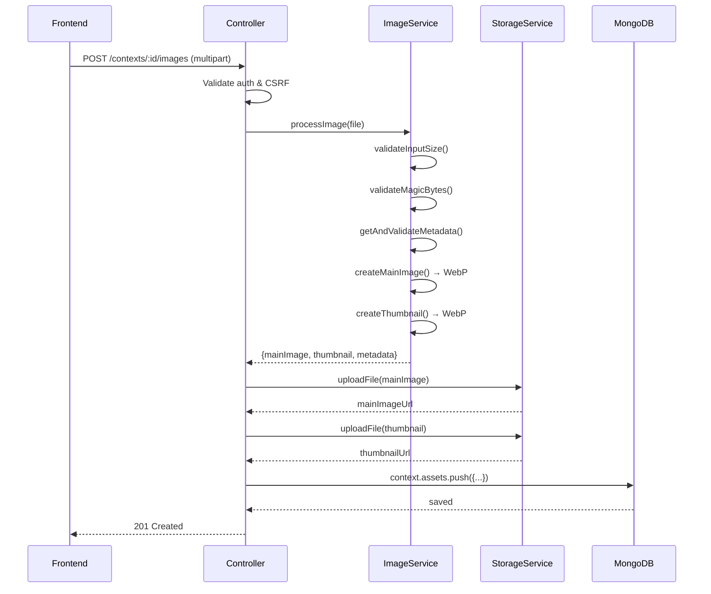

# Procesamiento y Validación de Assets

Este documento describe el sistema de procesamiento y validación de archivos multimedia (imágenes y audio) implementado en el backend.

## Índice

1. [Visión General](#visión-general)
2. [Procesamiento de Imágenes](#procesamiento-de-imágenes)
3. [Validación de Audio](#validación-de-audio)
4. [Almacenamiento](#almacenamiento)
5. [Seguridad](#seguridad)
6. [Configuración](#configuración)
7. [Ejemplos de Uso](#ejemplos-de-uso)

---

## Visión General

El sistema de assets permite a los profesores subir contenido multimedia (imágenes y audio) para enriquecer los contextos de juego. Cada contexto puede tener hasta **30 assets**, donde cada asset puede incluir:

- **Imagen principal** (WebP, máx 768x768)
- **Thumbnail** (WebP, 256x256)
- **Audio** (MP3/OGG, máx 5MB)

### Arquitectura

```
┌─────────────────┐     ┌────────────────────┐     ┌──────────────────┐
│   Frontend      │────▶│  assetController   │────▶│  Supabase        │
│   (Multer)      │     │                    │     │  Storage         │
└─────────────────┘     └────────────────────┘     └──────────────────┘
                               │
                    ┌──────────┴──────────┐
                    ▼                     ▼
          ┌─────────────────┐   ┌─────────────────┐
          │ imageProcessing │   │ audioValidation │
          │    Service      │   │    Service      │
          └─────────────────┘   └─────────────────┘
                    │
                    ▼
          ┌─────────────────┐
          │     sharp       │
          │   (WebP conv)   │
          └─────────────────┘
```

---

## Procesamiento de Imágenes

### Servicio: `imageProcessingService.js`

El servicio de procesamiento de imágenes realiza las siguientes operaciones:

#### 1. Validación por Magic Bytes

Antes de procesar cualquier imagen, se verifica el tipo real del archivo mediante los primeros bytes (magic bytes). Esto previene:

- **Falsificación de extensiones** (ej: un `.exe` renombrado a `.png`)
- **Ataques de inyección** mediante archivos maliciosos

```javascript
// Formatos permitidos
const ALLOWED_INPUT_MIMES = [
  'image/png',
  'image/jpeg', 
  'image/gif',
  'image/webp'
];
```

#### 2. Validación de Dimensiones

| Parámetro | Valor |
|-----------|-------|
| Mínimo | 256 × 256 px |
| Máximo entrada | 2048 × 2048 px |
| Máximo salida | 768 × 768 px |
| Thumbnail | 256 × 256 px |

Las imágenes que excedan el máximo de salida se redimensionan automáticamente manteniendo el aspect ratio.

#### 3. Conversión a WebP

Todas las imágenes se convierten a formato **WebP** con calidad del **85%**. Esto proporciona:

- **Mejor compresión** (~25-35% menor que JPEG)
- **Transparencia** (soporta canal alpha)
- **Calidad consistente** en todos los assets

#### 4. Generación de Thumbnails

Se genera automáticamente un thumbnail de 256×256 px para cada imagen, útil para:

- Previsualizaciones en listas
- Carga rápida en el juego
- Reducción de ancho de banda

### Límites de Tamaño

| Tipo | Límite |
|------|--------|
| Archivo de entrada | 8 MB |
| Imagen procesada | ~200-500 KB (típico) |
| Thumbnail | ~20-50 KB (típico) |

---

## Validación de Audio

### Servicio: `audioValidationService.js`

El servicio de validación de audio verifica:

#### 1. Formatos Permitidos

| Formato | MIME Type | Extensión |
|---------|-----------|-----------|
| MP3 | `audio/mpeg` | `.mp3` |
| OGG | `audio/ogg` | `.ogg` |

> **Nota:** `audio/mp3` se normaliza automáticamente a `audio/mpeg`.

#### 2. Validación por Magic Bytes

Similar a las imágenes, se verifica el contenido real del archivo para prevenir falsificaciones.

#### 3. Límites

| Parámetro | Valor |
|-----------|-------|
| Tamaño máximo | 5 MB |
| Duración mínima | 0.3 segundos |
| Duración máxima | 45 segundos |
| Duración recomendada | ≤ 30 segundos |

La duración **sí se valida server-side** mediante metadata real del audio (`music-metadata`).

Si no se puede leer la duración (archivo corrupto o metadata inválida), el backend rechaza el upload.

---

## Almacenamiento

### Servicio: `storageService.js`

Los archivos se almacenan en **Supabase Storage**. El servicio proporciona:

#### Estructura de Rutas

```
bucket/
├── contexts/
│   └── {contextId}/
│       ├── images/
│       │   ├── {assetKey}_main.webp
│       │   └── {assetKey}_thumb.webp
│       └── audio/
│           └── {assetKey}.mp3
```

#### Sanitización de Nombres

Los nombres de archivo se sanitizan para prevenir:

- **Path traversal** (`../../../etc/passwd`)
- **Caracteres especiales** que puedan causar problemas
- **Colisiones** con timestamps

```javascript
// Ejemplo de sanitización
"Mi Archivo (1).png" → "mi_archivo_1_1703865600000.webp"
```

#### URLs Públicas

Los archivos son accesibles mediante URLs públicas de Supabase:

```
https://{project}.supabase.co/storage/v1/object/public/{bucket}/contexts/{contextId}/images/{key}_main.webp
```

---

## Seguridad

### Medidas Implementadas

| Capa | Protección |
|------|------------|
| **Autenticación** | JWT requerido para todos los endpoints de upload |
| **Rate Limiting** | 20 uploads/hora por IP |
| **Magic Bytes** | Validación del contenido real del archivo |
| **Multer fileFilter** | Validación preliminar de MIME type |
| **Tamaño** | Límites estrictos (8MB imágenes, 5MB audio) |
| **Duración audio** | Validación real de duración (0.3s-45s) |
| **Sanitización** | Nombres de archivo seguros |
| **CSRF** | Double-submit: cookie `csrfToken` + header `X-CSRF-Token` |

### Vulnerabilidades Prevenidas

1. **Arbitrary File Upload**: Solo se permiten formatos específicos validados por magic bytes
2. **Path Traversal**: Sanitización de nombres de archivo
3. **DoS por tamaño**: Límites estrictos de tamaño
4. **XSS via SVG**: SVG no está permitido (solo WebP de salida)
5. **Rate Limiting Bypass**: Límites por IP en uploads

### Rollback en Errores

Si ocurre un error después de subir archivos (ej: fallo al guardar en BD), el sistema elimina automáticamente los archivos ya subidos para evitar huérfanos.

---

## Configuración

### Variables de Entorno

```env
# Supabase Storage
SUPABASE_URL=https://xxx.supabase.co
SUPABASE_SERVICE_KEY=eyJ...
SUPABASE_BUCKET=rfid-games-assets
```

### Constantes de Configuración

#### IMAGE_CONFIG (imageProcessingService.js)

```javascript
{
  ALLOWED_INPUT_MIMES: ['image/png', 'image/jpeg', 'image/gif', 'image/webp'],
  OUTPUT_FORMAT: 'webp',
  WEBP_QUALITY: 85,
  MIN_WIDTH: 256,
  MIN_HEIGHT: 256,
  MAX_WIDTH: 2048,
  MAX_HEIGHT: 2048,
  OUTPUT_MAX_WIDTH: 768,
  OUTPUT_MAX_HEIGHT: 768,
  THUMBNAIL_WIDTH: 256,
  THUMBNAIL_HEIGHT: 256,
  MAX_INPUT_SIZE: 8 * 1024 * 1024  // 8MB
}
```

#### AUDIO_CONFIG (audioValidationService.js)

```javascript
{
  ALLOWED_MIMES: ['audio/mpeg', 'audio/ogg', 'audio/mp3'],
  ALLOWED_EXTENSIONS: ['.mp3', '.ogg'],
  MAX_SIZE: 5 * 1024 * 1024,  // 5MB
  MIN_DURATION_SECONDS: 0.3,
  MAX_DURATION_SECONDS: 45,
  RECOMMENDED_MAX_DURATION_SECONDS: 30
}
```

### Endpoint de configuración para frontend

El backend expone `GET /api/contexts/upload-config` para alinear reglas de UI con validación real server-side.

Incluye:

- `image.allowedFormats`
- `image.maxInputSizeMB`
- `audio.allowedFormats`
- `audio.maxSizeMB`
- `audio.minDurationSeconds`
- `audio.maxDurationSeconds`
- `audio.recommendedMaxDurationSeconds`

Esto evita discrepancias entre mensajes de frontend y restricciones efectivas del backend.

---

## Ejemplos de Uso

### Subir Imagen

```bash
curl -X POST \
  -H "Authorization: Bearer {token}" \
  -H "X-CSRF-Token: {csrf}" \
  -F "image=@bandera_espana.png" \
  -F "key=espana" \
  -F "value=España" \
  -F "display=🇪🇸" \
  http://localhost:5000/api/contexts/{contextId}/images
```

**Respuesta:**
```json
{
  "success": true,
  "message": "Imagen subida y procesada correctamente",
  "data": {
    "key": "espana",
    "value": "España",
    "display": "🇪🇸",
    "imageUrl": "https://xxx.supabase.co/.../espana_main.webp",
    "thumbnailUrl": "https://xxx.supabase.co/.../espana_thumb.webp"
  }
}
```

### Subir Audio

```bash
curl -X POST \
  -H "Authorization: Bearer {token}" \
  -H "X-CSRF-Token: {csrf}" \
  -F "audio=@espana_pronunciacion.mp3" \
  -F "key=espana" \
  http://localhost:5000/api/contexts/{contextId}/audio
```

**Respuesta:**
```json
{
  "success": true,
  "message": "Audio subido correctamente",
  "data": {
    "key": "espana",
    "audioUrl": "https://xxx.supabase.co/.../espana.mp3"
  }
}
```

### Obtener Configuración

```bash
curl -X GET \
  -H "Authorization: Bearer {token}" \
  http://localhost:5000/api/contexts/upload-config
```

### Eliminar Imagen

```bash
curl -X DELETE \
  -H "Authorization: Bearer {token}" \
  -H "X-CSRF-Token: {csrf}" \
  http://localhost:5000/api/contexts/{contextId}/images/espana
```

---

## Flujo Completo de Subida



---

*Última actualización: 29-12-2025*
